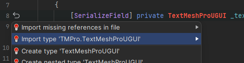

### Adding a namespace with your IDE
Most IDEs will help you reference the appropriate namespaces by providing quick actions when your caret is on the relevant block of code.
Visual Studio has [Quick Actions](https://docs.microsoft.com/en-us/visualstudio/ide/quick-actions),
Visual Studio Code has [Quick Fixes](https://code.visualstudio.com/docs/editor/refactoring#_code-actions-quick-fixes-and-refactorings),
and Rider has [Intention Actions](https://www.jetbrains.com/help/idea/intention-actions.html).

^^^

^^^If your IDE isn't showing errors or quick fixes, you need to [configure your IDE](/IDE%20Configuration.md).{.warning}

Take care to add the correct namespace.
