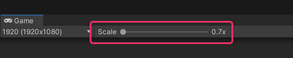

The scale slider at the top of the Game view represents the Game view scaling relative to the selected aspect or resolution chosen in the same toolbar.

**1x does not represent filling the Game view**, the value at the left-hand side of the slider fills the Game view.

^^^

^^^ The Game view is displayed at 70% of 1920x1080

If you can't change the scale to **1x**, make sure **low resolution aspect ratios** is unchecked in the resolution/aspect ratio dropdown.
