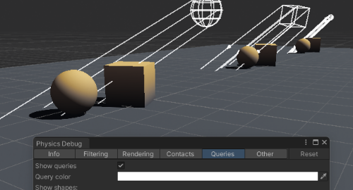

Unity's [Debug.DrawRay](https://docs.unity3d.com/ScriptReference/Debug.DrawRay.html) and [Debug.DrawLine](https://docs.unity3d.com/ScriptReference/Debug.DrawLine.html) are valuable tools for debugging 3D (and 2D) information.  
By drawing lines in the Scene and Game view you can validate assumptions about positions and directions used in code.
### Usage
Lines not drawn continuously will appear for a single frame, to counteract this a **duration** can be provided as the fourth parameter.  
Make sure that the variables used in your draw functions are the same as those used by the functionality you are debugging.

:::info
If lines don't appear, ensure Gizmos are enabled for that view
:::

#### DrawRay
Note that `DrawRay` takes a position and a **direction**.  
Scaling a *normalized* vector will produce a vector with that length. This can be done here to make the output more visible.  
<<Code/Drawing/Draw Functions 1.rtf>>

If you're passing two positions to this function the results will be unexpected. Use `DrawLine` instead.

#### DrawLine

<<Code/Drawing/Draw Functions 2.rtf>>

## Physics debugger
If you trying to debug physics queries (overlap, check, cast), you can use the physics debugger (**Window | Analysis | Physics Debugger**).

^^^

^^^ Physics debugger showing queries in the Scene view

:::warning  
Your version of Unity may not have the Queries tab, you would have to update to draw queries using built-in functionality.
:::

## Drawing packages
### Vertx.Debugging
I've created a custom debug drawing package called [Vertx.Debugging](https://github.com/vertxxyz/Vertx.Debugging) for drawing wireframe shapes.  
It has drop-in replacements for physics functions (casts, overlaps, hits, checks), many extra shapes, and can draw labels in the scene.  
It is designed for editor debugging and most functions will be stripped when built.

^^^

^^^ Visualised shapes and casts from [Vertx.Debugging](https://github.com/vertxxyz/Vertx.Debugging)

### Unity Physics
If you are using Entities (ECS), [Unity Physics](https://docs.unity3d.com/Packages/com.unity.physics@latest) (`com.unity.physics`) has `PhysicsDebugDisplaySystem`, which contains static helper methods for drawing wireframe shapes from jobs.  
:::warning{.small}  
If you do not understand what Entities is, you should not use this package for debugging.  
:::  
There is also the [Physics Debug Display](https://docs.unity3d.com/Packages/com.unity.physics@latest/index.html?subfolder=/manual/component-debug-display.html) authoring component that has toggles for similar debugging to the [Physics Debugger](#physics-debugger).

### Raycast Visualization
[Raycast Visualization](https://github.com/nomnomab/RaycastVisualization) is a drop-in replacement for Physics queries.  
It is designed for editor debugging and most functions will be stripped when built.

### ALINE
[ALINE](https://arongranberg.com/aline/) is a paid alternative that is intended to draw shapes in the editor and builds, and supports drawing from jobs.

### Shapes
[Shapes](https://acegikmo.com/shapes/) is a paid alternative that is designed to draw good looking lines for editor and builds.