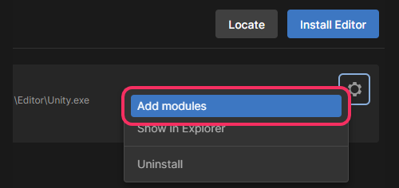

## IL2CPP not installed
Using the Unity Hub, navigate to the installs page, select your install and select **add modules**[^1].  

^^^

^^^ Add modules in the Unity Hub

Tick only **Windows Build Support (IL2CPP)** and continue.  
If this is your first time installing IL2CPP support you may also have to follow [these steps](IL2CPP%20Building.md).

---

If this has not fixed your issue, double-check your project is running on the Unity version you modified.

[^1]: If you cannot add modules to an install, it may have been installed manually. Re-run the installer.
