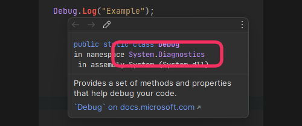

# [CS1061](https://docs.microsoft.com/en-us/dotnet/csharp/language-reference/compiler-messages/cs1061)

```
Type 'Foo' does not contain a definition for 'Bar' and no extension method 'Bar' of type 'Foo' could be found (are you missing a using directive or an assembly reference?)
```

The type you are using does not contain the member you are trying to use.

## Resolution
:::warning
If you do not have autocomplete, please [configure your IDE](../IDE%20Configuration.md).
:::

Hover over the type and ensure it has the namespace you expect.

^^^

^^^ Inspecting a namespace

### Either
- The wrong namespace is imported.
- The type is redefined in the namespace you are using.
- The member is an extension method in another namespace.
- The type doesn't contain the member.

:::note
### The wrong namespace is imported
Make sure you remove that namespace at the top of your file and import the correct one.
Remove the incorrect namespace if you do not intend to use it.

---
If you have namespace conflicts, you can resolve a type to match a specific namespace like:

```csharp
using Debug = UnityEngine.Debug;
```
Or you can be specific every time that type is used:
```csharp
UnityEngine.Debug.Log("Example");
```

:::

:::note
### Type is redefined in the namespace you are using
Make sure you have not named a class the same as the one you are trying to use.
If **this** class is the same as the target, then **you should probably rename it**, but you can also be specific about what type is used:
```csharp
UnityEngine.Debug.Log("Example");
```

:::

:::note  
### The member an extension method in another namespace
Research what namespace the member belongs to by searching the name of the member online.
See [CS0246](CS0246.md) for instructions regarding missing namespaces if you think this is the case.  
:::


:::note
### The type does not contain the member
Often this error is given when new programmers don't understand the distinction between a Type and an instance.
See [referring to members in other scripts](../References.md), do not try to use the type name to directly access a member.

If you still can't reference the member, you are likely mistaken and member does not exist at all. This could mean you are looking at documentation or examples that do not match the version of the code you are using.
:::
