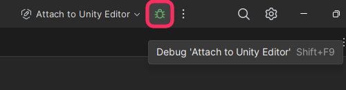
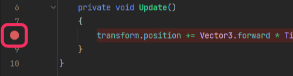
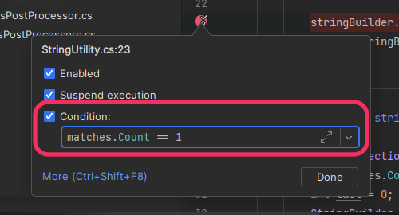
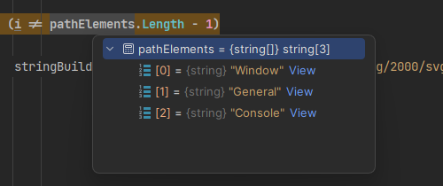

# The debugger

The debugger is a tool that can halt code execution. Values can be inspected, lines of code can be stepped over, and sometimes even modified.
This does not require recompiling your code, or exiting Play Mode.

A functioning IDE is required, so first check [IDE configuration](../IDE%20Configuration.md) if you are experiencing basic issues.

##  Attaching
Your IDE needs to target a running application to start debugging. Usually this functionality is found in one of the top utility bars in an IDE's interface.

^^^

^^^ Attaching Rider to the Unity Editor

##  Breakpoints
Breakpoints are the entry point to a debugging session. Mark a line with a breakpoint and execution will halt when this line is reached if the debugger is attached.

^^^

^^^ A breakpoint in Rider

When execution is halted **Unity will freeze**, this is normal. You can now use the other debugger features of your IDE to assess problems.
{.inline} **stop** debugging to resume Unity's normal function, or {.inline} **resume** to continue execution while remaining attached, ready to hit more breakpoints.

### Managing breakpoints
Select the gutter for an executable line to add a breakpoint. Repeat the selection to remove it.
You can {.inline} **view all breakpoints** to manage them in bulk, removing them all at once, or just finding forgotten ones.

### Muting breakpoints
Often you want to continue testing with the debugger connected, without triggering breakpoints. You can {.inline} **mute breakpoints** to stop them triggering without removing them. Individual breakpoints can also be {.inline} **disabled**.

### Conditional breakpoints
Right-click a breakpoint and after adding a condition based on in-scope variables the breakpoint will become a {.inline} **conditional breakpoint**, and only trigger when the condition is met.

^^^

^^^A conditional breakpoint in Rider

##  Tracepoints (logging breakpoints)
Disable the suspend execution setting of a {.inline} [breakpoint](#rider-breakpoint-breakpoints) via the right-click menu so it becomes a {.inline} **tracepoint**, navigate to more settings and add logging. The logs will print to the **IDE's debug console**, not Unity[^1].  
Tracepoints are a great substitution for [manual logging](Logging/How-to.md), avoiding unnecessary recompilation and Play Mode changes.

##  Variable inspection
Hovering over an initialised variable during debugging will provide you with a view of its internals. This lets you discover faulty logic or uninitialised values.
Often a debugger will also allow you to hover an expression to evaluate its outcome (the result of an if statement for example).

^^^

^^^ Inspecting a variable using Rider's debugger

##  Stepping
Stepping through code is a way to continue execution line by line, optionally stepping into or over functions and properties. This gives information about program execution, testing false assumptions about branching behaviour or loops.

| Name                                           | Description                                          |
|------------------------------------------------|------------------------------------------------------|
| {.inline} Step over  | Execute the line of code without entering functions. |
| {.inline} Step into  | Execute the line of code and enter any functions.    |
| {.inline} Step out     | Execute until the function is exited.                |

##  Pausing
Execution can be manually halted similar to a breakpoint, this is very helpful when debugging freezes caused by infinite loops. Just pause execution when the freeze occurs, and the debugger should lead you to the relevant section of code.

##  Watches
Watches are tracked variables that persist across debugging sessions. While execution is halted via a breakpoint or pause, you can monitor the state of variables via the Watch window, similar to [variable inspection](#rider-data-variable-inspection).

You can add any variable or expression that is in scope as a watch, and it will be tracked while you debug.

# Usage
##  Visual Studio
VS has a great rundown of their debugger found [here](https://docs.microsoft.com/en-us/visualstudio/debugger/debugger-feature-tour). Instructions about configuration are not specific to Unity and can be ignored, instead Unity has written a [how-to guide](https://unity.com/how-to/debugging-with-microsoft-visual-studio-2022).
If you're looking for video tutorials, [this video series](https://www.youtube.com/playlist?list=PLReL099Y5nRdW8KEd59B5KkGeqWFao34n) is a fantastic overview of using the debugger with Unity.
Combining the above resources should give you complete confidence to debug using Visual Studio.

##  Visual Studio Code
VSC does not come with a debugger built-in, the [Unity extension](../IDE%20Configuration/Visual%20Studio%20Code.md) needs to be manually installed.
How-to instructions for debugging can be found [here](https://code.visualstudio.com/docs/editor/debugging) with Debug actions, and Breakpoints being the most relevant information. Instructions about configuration are not specific to Unity and can be ignored.

##  JetBrains Rider
Rider has detailed information about debugging Unity applications [here](https://www.jetbrains.com/help/rider/Debugging_Unity_Applications.html) and [here](https://www.jetbrains.com/help/rider/Using_Breakpoints.html).
Rider also has:
- [Pausepoints](https://blog.jetbrains.com/dotnet/2020/06/11/introducing-unity-pausepoints-for-rider/), the ability to pause ([`Debug.Break`](https://docs.unity3d.com/ScriptReference/Debug.Break.html)) Unity at the end of a frame once a pausepoint is hit.
- {.inline} Inline watches, add variables or expressions to the inline preview by right-clicking a line and choosing **Add Inline Watch**.

# Debugging builds
Builds require **Development Build** and **Script Debugging** to be enabled in the build settings (**File | Build Settings**) to debug script code. When attaching the debugger attach to the built Player and not the Unity Editor.
More information can be found [here](https://docs.unity3d.com/Manual/ManagedCodeDebugging.html), including the debugging of mobile devices.

[^1]: JetBrains Rider now prints tracepoints to Unity's Console. Note that you can also view the Unity Console output in Rider.
