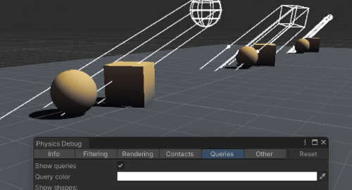

# Physics Debugger
You can open the Physics Debugger via **Window | Analysis | Physics Debugger**.

## Visualising queries
If you're trying to debug **3D** physics queries (overlap, check, cast) via the Queries tab.

^^^

^^^ Physics Debugger showing queries in the Scene view

:::warning  
Your version of Unity may not have the Queries tab, you would have to update to draw queries using built-in functionality.
:::

You can [visualise collision geometry](#visualising-collision-geometry) if it's unclear what's being hit by a query.

## Visualising collision geometry
You can show collision geometry in the scene by enabling its visibility from the overlay in the bottom right of the Scene view window.

---
[Return to visual debugging.](Visual%20Debugging.md)
