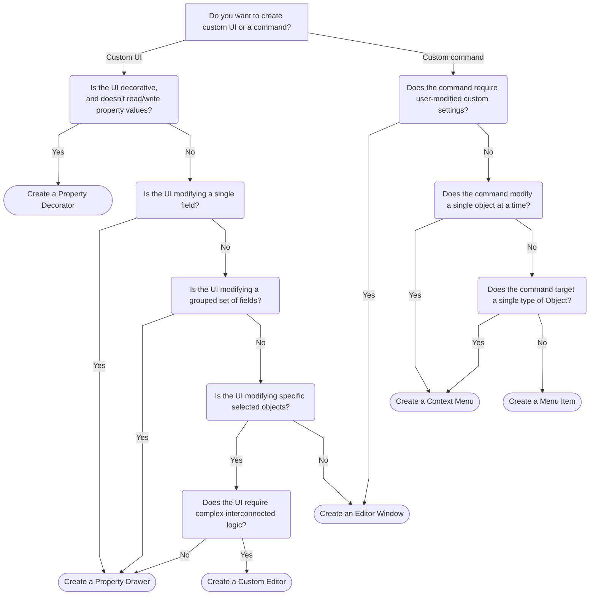

## Choosing a type of editor extension

### Notes
Even when creating a custom Editor you should consider using [property drawers](https://docs.unity3d.com/ScriptReference/PropertyDrawer.html) where possible, avoiding UI that doesn't use [`SerializedObject`](Serialisation/SerializedObject%20How-to.md) data.  
`PropertyField` ([UI Toolkit](https://docs.unity3d.com/ScriptReference/UIElements.PropertyField.html) • [IMGUI](https://docs.unity3d.com/ScriptReference/EditorGUILayout.PropertyField.html)) is the easiest way to draw a property in contexts like an `Editor` or `EditorWindow`, as it will respond to a property drawer without duplicated or embedded logic.
