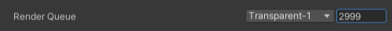

## Render Queue
Render Queue determines the order that objects are rendered.  
`Background` is 1000, `Geometry` is 2000, `AlphaTest` is 2450, `Transparent` is 3000 and `Overlay` is 4000.  
Shaders can define defaults in their subshader tags, which can also contain offsets from the keywords, eg. `Tags { "Queue" = "Transparent+1" }`. See [subshader tags](https://docs.unity3d.com/Manual/SL-SubShaderTags.html) for more information.  
Materials can override the render queue [via code](https://docs.unity3d.com/ScriptReference/Material-renderQueue.html) or via the inspector.  

  

Changing the render queue means objects cannot be batched together and may add more draw calls.  
Now that the objects' render order is fixed this may cause its own sorting issues, but depending on your project (and ultimately your camera's framing), this may be the appropriate solution.