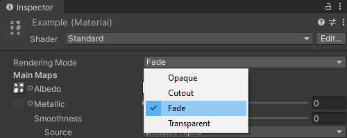

### Transparent Rendering Modes
#### Built-in Render Pipeline
The Transparent Rendering Mode attempts to mimic realistic transparent materials like clear plastic or glass.
This means that reflections and highlights will appear visible even on entirely transparent surfaces.  
You cannot entirely remove the influence of this rendering mode even when disabling Specular Highlights and Reflections.  
Instead, the Rendering Mode should be set to **Fade**, reflections and highlights will fade out as transparency does.

#### URP / HDRP
Ensure that the material is using the correct Blending Mode, a typical setup is using Alpha blending. If you intend to use another Blending Mode, enabling Alpha Clipping may make transparency function as expected.  

---

If you continue to have issues where a material does not appear properly transparent, check the original texture is **entirely** transparent in an external application.  

[I cannot edit my material](../Readonly%20Materials.md)