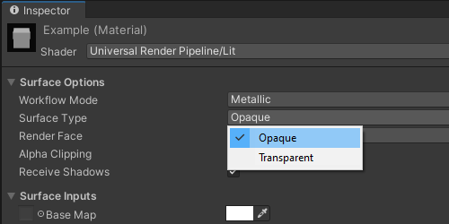

### Using Opaque Materials

#### Choosing an opaque material.  
Each render pipeline Unity uses has different shaders and different UIs for those shaders.  
Avoid anything that uses the words "Transparent" or "Fade".

#### Built-in Render Pipeline
The Standard shader has an Opaque [Rendering Mode](https://docs.unity3d.com/Manual/StandardShaderMaterialParameterRenderingMode.html). Cutout is also suitable if required.  
The Unlit shader has Color and Cutout.  
Custom shaders should render to depth, ie. `ZWrite On` (default), and ideally be in the Geometry [render queue](https://docs.unity3d.com/Manual/SL-SubShaderTags.html) (default).

#### URP / HDRP
For default render pipeline materials the Surface Type defined in the Surface Options dropdown for a material must be set to Opaque.  
  
Shaders created in Shadergraph should also be set to Opaque (default).

--- 

[I cannot edit my material](../Readonly%20Materials.md)