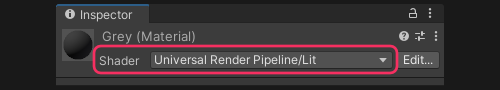

# Readonly materials

Materials can be readonly when imported from models or provided in readonly sources like packages.  
A particle system's default material is from built-in resources, and cannot be modified.

## Resolution
1. A new material should be created using the shader used by the material you want to replicate.  
  
You can also create a material from a shader by right-clicking on the shader and creating the material via the context menu.  
Material properties can be copied from one material to another via the right-click menu on the material header.
2. Enable and expand the **Renderer module** of the Particle system by ticking the checkbox and clicking on the title.
3. Assign the new material to the **Material** property of the module.
