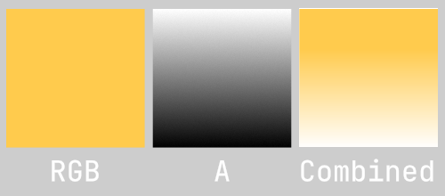

<<Abbreviations/Channel-Packing.md>>  
## Shader Graph: Alpha

The preview for RGBA nodes doesn't show the alpha (A) channel.  

All content in the RGB channels is displayed—even where it's covered by transparency (A). This information is often helpful to see in shaders, especially when dealing with channel-packed textures.

#### Why are there weird colours in the RGB channels of a typical transparent texture?
There are two reasons:  
:::note  
#### Straight alpha
Typically, textures export as straight alpha, where the RGB channels are untouched pure colour (unmatted, unassociated, not premultiplied), requiring the influence of the alpha channel to blend with the background.  
Any partially-transparent portion of the texture will have pure colour in the RGB channels.

^^^

^^^ Straight (unassociated) alpha
:::
:::note
#### Flooded colours
To reduce fringing artifacts at the transition between transparent parts of an image, colour is typically flood-filled into the surrounding areas by the application that created the original image, and this is what you are seeing.

This can even be done manually by an artist in the cases where an authoring program didn't do it itself. Mipmap levels, compression, and filtering can result in these values influencing the output, which external programs may not protect against by default.

Some programs may only do this to a distance seen as sufficient, flooding the rest with white (1, 1, 1) or black (0, 0, 0).
:::
### Resolution
Ignore the RGB representation of the image, and feed the Alpha (A) channel from the sampler into the Alpha output of the graph.

If you do want to see a version of the RGB where transparency is black, multiply the RGB channels with the A channel. It is best not to use this as the output as it may introduce transparency artifacts, but you can feed it into a [Preview Node](https://docs.unity3d.com/Packages/com.unity.shadergraph@latest/index.html?subfolder=/manual/Preview-Node.html).

:::info
To only use the A channel, you cannot directly pass RGBA to a node, you must use a [Split Node](https://docs.unity3d.com/Packages/com.unity.shadergraph@latest/index.html?subfolder=/manual/Split-Node.html) to get the Alpha value instead of the first Red channel.
:::
