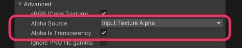
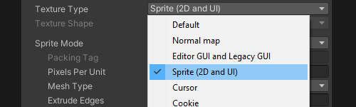

## Transparency settings
### Description
Unity will not import textures as transparent by default.

### Resolution
First, check that your source texture is actually transparent when viewed via another program.  
Next, check the Alpha Source is set to your alpha input, and Alpha Is Transparency is ticked.

  

#### For use in 2D and UI
2D and UI textures should be imported as Sprites. This should automatically set the above options when valid.

  