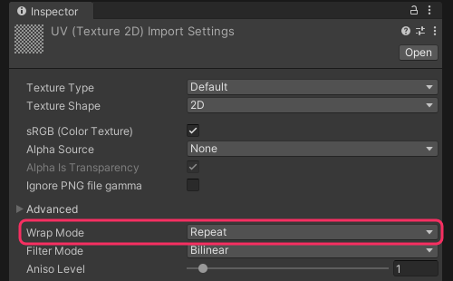

## Texture wrap mode: Repeat
### Description
<<Graphics/Wrap Mode.md>>

### Resolution
Navigate to the source asset in the [Project window](https://docs.unity3d.com/Manual/ProjectView.html), and switch the **Wrap Mode** to **Repeat**.  

  
