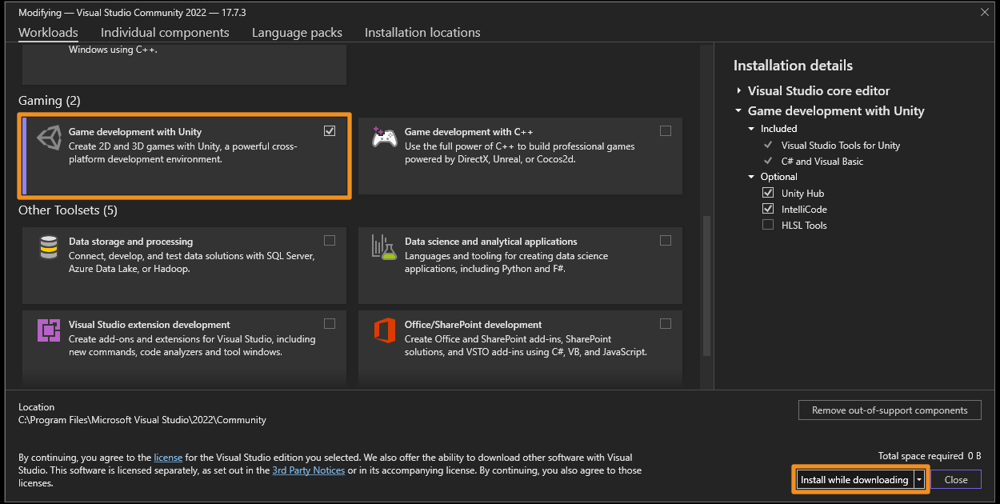

<<Abbreviations/UPM.md>>
#  Visual Studio configuration
- [Installation](#installing-visual-studio)
- [Configuration](#configuring-visual-studio)
- [Troubleshooting](#if-you-are-experiencing-issues)

## Installing Visual Studio
::::note  
### Install via the Unity Hub
Select **Microsoft Visual Studio Community** when installing a Unity version (**Installs | Install Editor**),
or install it as a [module](../Unity%20Hub/Module%20Installation.md) to an existing Unity install.

Follow the [configuration instructions](#configuring-visual-studio) for remaining setup.
::::  
::::note  
### Install manually
:::info{.small}
Prefer installing [via the Unity Hub](#install-via-the-unity-hub).
:::

1. Download and open the [Visual Studio installer](https://learn.microsoft.com/en-us/visualstudio/install/install-visual-studio).
1. Select **Install**.
1. Select the **Workloads** tab, then select the **Game development with Unity** workload.
   ^^^{.foldout}
   
   ^^^ Game development with Unity workload.
1. Select **Install** to complete the installation.

Follow the [configuration instructions](#configuring-visual-studio) for remaining setup.
::::

## Configuring Visual Studio

1. If Visual Studio was installed manually, install the **Game development with Unity** workload.
   ^^^{.foldout}
   :::normal
   1. Open the Visual Studio Installer.
   1. Select the **Workloads** tab, then select the **Game development with Unity** workload.
   1. Select **Install**.
   :::
   
   ^^^ Game development with Unity workload.
1. Ensure the [Visual Studio Editor](https://docs.unity3d.com/Manual/com.unity.ide.visualstudio.html) package installed and updated in UPM (`com.unity.ide.visualstudio`).
1. Set the **External Script Editor** dropdown in Unity's External Tools preferences (**Edit | Preferences | External Tools**) to Visual Studio.

:::note
[Official configuration steps.](https://learn.microsoft.com/en-us/visualstudio/gamedev/unity/get-started/getting-started-with-visual-studio-tools-for-unity)
:::

## If you are experiencing issues

- If you have compiler errors, resolve them or [comment out](https://learn.microsoft.com/en-us/dotnet/csharp/language-reference/tokens/comments) those files so Unity can compile code.
- Ensure the [Visual Studio Editor](https://docs.unity3d.com/Manual/com.unity.ide.visualstudio.html) package is installed and updated in UPM (`com.unity.ide.visualstudio`).
- Regenerate project files via Unity.
  1. Close VS.
  1. Select **regenerate project files** in **Edit | Preferences | External Tools**.
  1. Reopen VS via **Assets | Open C# Project**.
- Regenerate project files via VS.
  - If an assembly in the Solution Explorer is marked as **(incompatible)**, right-click it and select **reload with dependencies**.
- Restart your computer.

---

[Return to general IDE configuration.](../IDE%20Configuration.md)
