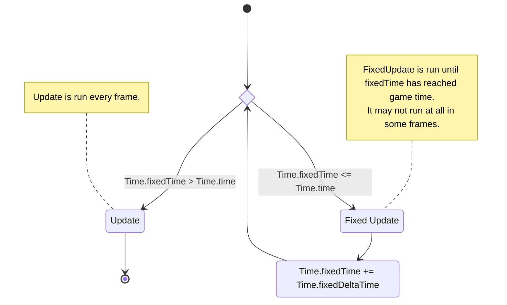

# Understanding FixedUpdate

Fixed Update runs only when required. It's run multiple times a frame to catch up to the current time, and it's skipped when ahead.  

I like to look at this way: Fixed Update is fake 😲  

Fixed Update is run repeatedly until fixed time catches up with game time, and the result is displayed. This keeps the delta time a _fixed_ length (resulting in consistent simulation[^1]), at the cost of fixed time not perfectly aligning to real time.  
For example, you could advance Fixed Update `1 / Time.fixedDeltaTime` times to move it forward by a second. That can be done in an instant, ignoring real time, and that's what Fixed Update is doing.   

:::info  
You can read Unity's version of this description in the [Important Classes - Time](https://docs.unity3d.com/Manual/TimeFrameManagement.html) section of the scripting manual.  
:::

## Frame diagram example

^^^  

```mermaid
---
displayMode: compact
---
gantt
    dateFormat SSS
    tickInterval 2millisecond
    axisFormat •
    section Frame no.
        0: 000, 9ms
        1: 7ms
        2: 9ms
        3: 11ms
    section Main thread
        ...: 000, 1ms
        Fixed Update: 3ms
        Update: 4ms
        ...: 2ms
        Fixed Update: 3ms
        Update: 2ms
        ...: 2ms
        Update: 7ms
        ...: 2ms
        Fixed Update: 3ms
        Fixed Update: 3ms
        Update: 3ms
        ...: 1ms
```  

^^^ See that Fixed Update may run multiple times a frame, or not at all.

You can use the **timeline** view of the [Unity Profiler](https://docs.unity3d.com/Manual/Profiler.html) to see what is actually occuring in your frame.

:::info  
[`FixedUpdate`](https://docs.unity3d.com/ScriptReference/MonoBehaviour.FixedUpdate.html) isn't the only code running at this fixed rate.  
You can see an expanded version of a frame in the Unity documentation: [order of execution for event functions](https://docs.unity3d.com/Manual/ExecutionOrder.html).  
:::

Don't think about Update and FixedUpdate as executing in parallel, because it is completely linear.  
Background threads do work, including scheduling rendering, performing parallel tasks, and so on. But the execution of your `Update`/`FixedUpdate` code is linear.

## Fixed Update diagram
:::note{.center}  
Start at the top, and follow the 🔷 choices until the diagram exits.  
:::

^^^  

^^^ ::This logic is simplified for consumption. Unity provide their own [time logic diagram](https://docs.unity3d.com/Manual/TimeFrameManagement.html#:~:text=higher%20CPU%20load.-,Unity%E2%80%99s%20Time%20Logic,-The%20following%20flowchart). The native Unity source is not public, so we can't see the code. Entities implements similar logic in [`RateUtils.FixedRateCatchUpManager`](https://github.com/needle-mirror/com.unity.entities/blob/4687de6a32cbcd99443282806fa6393f1ab1ca35/Unity.Entities/RateUtils.cs#L140).::{.info}

## Notes
### Input in `FixedUpdate`
Because `FixedUpdate` is not guaranteed to run every frame, this makes it a very poor place to poll instantaneous input.

### Maximum delta time
[`Time.maximumDeltaTime`](https://docs.unity3d.com/ScriptReference/Time-maximumDeltaTime.html) bounds the number of times fixed update can run due to a this limit on the amount of time that can pass in one frame[^2]. 
This helps prevent a fixed update cascade, where the cost of running many fixed updates to catch up causes the frame time to rise, which in turn causes more fixed updates.

[^1]: If you want to understand why variable time is complicated, Unity has written some complex blogs like [fixing Time.deltaTime in Unity 2020.2 for smoother gameplay: What did it take?](https://blog.unity.com/engine-platform/fixing-time-deltatime-in-unity-2020-2-for-smoother-gameplay)  
[^2]: This is a virtual time limit. The frame will still take the same amount of real time to run.
