## Understanding FixedUpdate

Fixed Update is run when it's required, it is not run every frame, and it's sometimes run multiple times.  

I like to look at this way... Fixed Update is fake 😲  
We can simulate what happens after one second by running Fixed Update `1 / Time.fixedDeltaTime` times and it can be done in an instant; and that is practically what Fixed Update is doing. 
It is run repeatedly until fixed time catches up with real time, and the result is displayed. This keeps the delta time a _fixed_ length (resulting in consistent simulation)[^1], at the cost of fixed time not perfectly aligning to real time.

### Frame diagram

Do not visualise core logic in a project using MonoBehaviours as parallel, because it is completely linear.  
Background threads do work, including scheduling rendering, performing parallel tasks, and so on. But the execution of your `Update`/`FixedUpdate` code is linear.

^^^  

```mermaid
---
displayMode: compact
---
gantt
    dateFormat  SSS
    tickInterval 2millisecond
    axisFormat •
    section Frame
        1: 000, 18ms
        2: 5ms
        3: 13ms
    section Main thread
        ...: 000, 1ms
        FixedUpdate: 5ms
        FixedUpdate: 4ms
        Update: 7ms
        ...: 2ms
        Update: 3ms
        ...: 2ms
        Update: 7ms
        FixedUpdate: 4ms
        ...: 1ms
```  

^^^ See that Fixed Update may run multiple times a frame, or not at all.

You can use the **timeline** view of the [Unity Profiler](https://docs.unity3d.com/Manual/Profiler.html) to see what is actually occuring in your frame.

### Fixed Update diagram
Start at the top right dot, and follow the 🔷 choices until the diagram exits.

^^^  

^^^ This logic is likely simplified, the native Unity source is not public.

[`FixedUpdate`](https://docs.unity3d.com/ScriptReference/MonoBehaviour.FixedUpdate.html) isn't the only code running at this fixed rate.
You can see an expanded version of this diagram in the Unity documentation: [order of execution for event functions](https://docs.unity3d.com/Manual/ExecutionOrder.html).

### Notes
#### Input in `FixedUpdate`
Because `FixedUpdate` is not guaranteed to run every frame, this makes it a very poor place to poll instantaneous input.

[^1]: If you want to understand why variable time is complicated, Unity has written some complex blogs like [fixing Time.deltaTime in Unity 2020.2 for smoother gameplay: What did it take?](https://blog.unity.com/engine-platform/fixing-time-deltatime-in-unity-2020-2-for-smoother-gameplay)