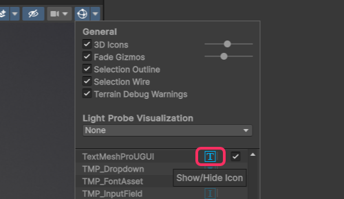

## Disabling Gizmo Icons
### Resolution
In the Gizmos dropdown at the top right of the view click the **icon** of the gizmo you wish to disable.  
The toggle will only disable the gizmos, not the icon.

