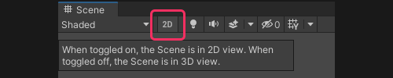

## Scene view: Flythrough mode
### Hold right mouse while moving
You must hold the **right mouse button** to use <kbd>W</kbd>, <kbd>S</kbd>, <kbd>A</kbd>, and <kbd>D</kbd> navigation to fly through the scene.

### Set the camera speed multiplier to a reasonable value
Make sure the camera speed is set to a reasonable multiplier like **1**.  

You can change this setting via the camera dropdown in the [View Options toolbar](https://docs.unity3d.com/Manual/ViewModes.html) overlay, which is anchored to the top right of the Scene view by default.  
Alternatively, you can use the **scroll wheel** while holding the **right mouse button** in the Scene view to change the speed.

### Set the camera to Perspective

**Disable** the 2D toggle in the [View Options toolbar](https://docs.unity3d.com/Manual/ViewModes.html) overlay.  

Click the center of the [Scene gizmo](https://docs.unity3d.com/Manual/SceneViewNavigation.html) or the label below the gizmo to toggle between **Perspective** and **Orthographic** views. Change it to **Perspective**.  

---

[Return to Scene view issues.](../Scene%20View.md)
