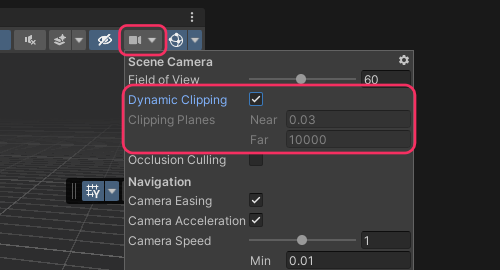

## Scene view: Camera
Select an object and press <kbd>F</kbd> to center the Scene view camera on the object. This will also reset the clipping planes of the camera.  

Manually adjust the Scene camera's clipping planes via the dropdown in the Scene view toolbar.
Generally, dynamic clipping should be enabled unless specific requirements are needed.

  