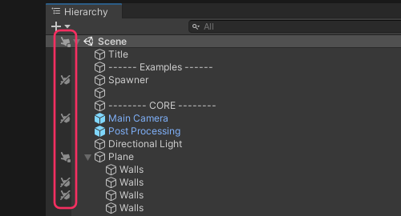

## Scene View: Selection
Check that Scene pickability is not disabled for the object in question.

  

To toggle pickability for an object and its children, click the icon in the left-hand pane. Individual objects can be toggled with an <kbd>Alt+Click</kbd>.  
See [Picking and selecting GameObjects](https://docs.unity3d.com/2020.1/Documentation/Manual/ScenePicking.html) for more information.  

---  

[I still cannot select items in the Scene view](Layer%20Selection.md)