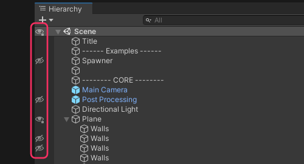
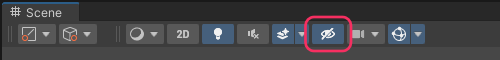

## Scene view: visibility
Check that Scene visibility is not disabled for the object in question.

Visibility can be toggled for an object and its children by clicking the icon. Individual objects can be toggled with an <kbd>Alt+Click</kbd>.  
Toggle an isolated view of an object with the shortcut <kbd>Shift+H</kbd>.  
Toggle Scene visibility entirely using the eye icon on the Scene view toolbar.  

See [Scene visibility](https://docs.unity3d.com/2020.1/Documentation/Manual/SceneVisibility.html) for more information.  

---  

[I still cannot see items in the Scene view](Layer%20Visibility.md)