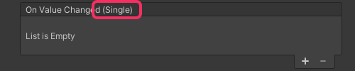
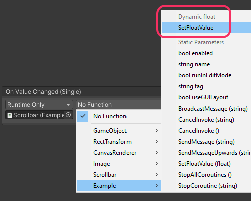

## UnityEvent Dynamic Values
### Description
Certain UnityEvents pass parameters, often these are from UI components like a Scrollbar, Input Field, or Toggle.  
UnityEvents that send values can do so dynamically or statically.  
Static values are set in the inspector, and dynamic values are passed via code.

### Resolution

1. Ensure that the target method takes the same parameter that the UnityEvent sends  

Looking at the UnityEvent Inspector you can compare the parameter to your own.  
Unity shows these as the .Net Type, not the keyword. This means that it shows `Single` instead of `float`, `Boolean` instead of `bool`, etc. Your code can use the standard keyword types.

2. Choose the target method from the **Dynamic** section of the function list.  

If you can select a value for the parameter you have **not** selected from the **Dynamic** section of the function list.  
If the method does not appear in the dynamic section, but appears in the static section, then you have failed step 1.

---  

[The method doesn't appear in the functions list at all](Method%20Requirements.md)