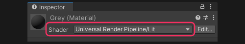

## Readonly materials

Materials can be readonly when imported from models or provided in readonly sources like packages.  
A model's material is a generated asset created by the importer, and cannot be modified.

### Resolution
#### Remapping model materials
Materials imported from models either must be extracted, or remapped on the model's importer.  
Select the model and head to the materials tab.
From there you can choose to either extract the materials, which will place them in a folder and remap them in the importer;
or you can remap the materials manually to others in your project.  
See the [materials tab](https://docs.unity3d.com/Manual/FBXImporter-Materials.html) documentation for more information.

#### Replacing materials on instances
Alternatively you can replace the material used on a prefab that isn't a model prefab (a prefab directly generated from a model), or an instance, by dragging a different material into the materials slots on the [Renderer](https://docs.unity3d.com/Manual/class-MeshRenderer.html#materials) component.  

#### Creating materials
Other Materials may be readonly because they are built-in, or provided by packages. In this case a new material should be created using the shader used by the material you want to replicate.  
  
You can also create a material from a shader by right-clicking on the shader and creating the material via the context menu.  
Material properties can be copied from one material to another via the right-click menu on the material header.