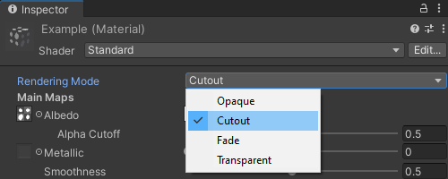
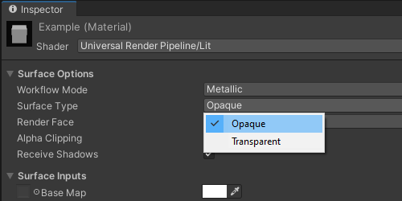
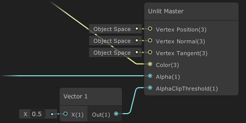

# Using cutout materials

Cutout materials render completely opaque portions that write to depth, and others that are entirely see-through, depending on an input alpha texture.  
These materials may also be referred to as alpha clip or alpha tested.

## Choosing a cutout material.  
Each render pipeline Unity uses has different shaders and different UIs for those shaders.  
Avoid anything that uses the words "Transparent" or "Fade".

## Built-in Render Pipeline
The Standard shader has an Cutout [Rendering Mode](https://docs.unity3d.com/Manual/StandardShaderMaterialParameterRenderingMode.html).  
The Unlit shader has a Cutout variant.  
  
Custom shaders should render to depth, `ZWrite On` (default), and ideally be in the AlphaTest [render queue](https://docs.unity3d.com/Manual/SL-SubShaderTags.html) (default).  
HLSL shader programs should implement the `clip()` function in the fragment pass.  
Surface shaders must provide `alphatest:VariableName`. See [optional parameters](https://docs.unity3d.com/Manual/SL-SurfaceShaders.html) and look for examples of Alpha Clip shaders.

## URP or HDRP
For default render pipeline materials the Surface Type defined in the Surface Options dropdown for a material must be set to **Opaque**, and the **Alpha Clipping** checkbox must be enabled.  
  
Shaders created in Shadergraph should also be set to Opaque (default). In some versions of Shadergraph it is important to pass an input into the Alpha Clip Threshold variable, or else the clipping will not function. The input to Alpha is what drives the query against the clipping threshold.  

--- 

[I cannot edit my material.](../Readonly%20Materials.md)
