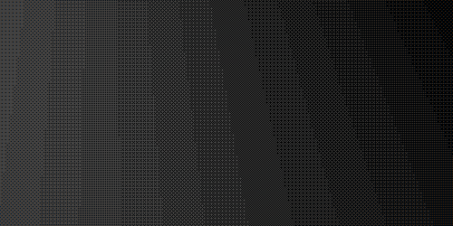
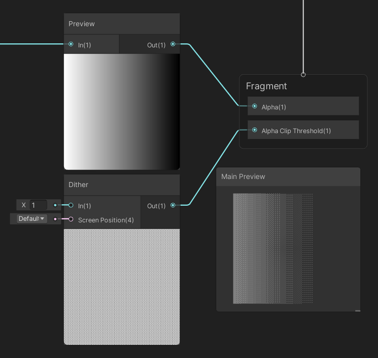

### Dithered Materials
Dithered materials are alpha-tested cutoff materials that use a screen-space mask effect to give the illusion of partial transparency.  
Alpha-tested materials are effectively opaque where they are rendered and as opaque objects can write to depth they can be properly sorted with other objects and are rendered before transparent objects.  
Dithered materials are often used to fade out objects when they pass close to or obscure the camera.  

#### Legacy/Default Render Pipeline
Authoring dithered shaders is fairly complex, so looking for pre-authored solutions or tutorials in shader authoring tools is advisable for the faint-hearted. For those that want to author their own there are lovely tutorials out there, like [this one](https://www.ronja-tutorials.com/2019/05/11/dithering.html) by [Ronja](https://twitter.com/TotallyRonja).

#### URP / HDRP
Shadergraph makes authoring dithered shaders pretty straight forward. Take an [alpha-clip](Transparent%20To%20Cutout.md) shadergraph and add a dither node before the Alpha Clip Threshold or Alpha outputs, both will require different values passed through to Alpha Clip Threshold, but you can test what works best for you by trial and error.  
