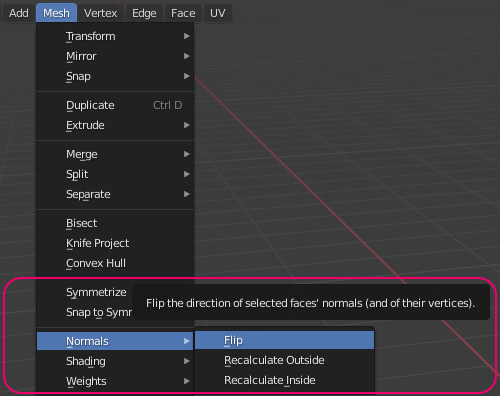
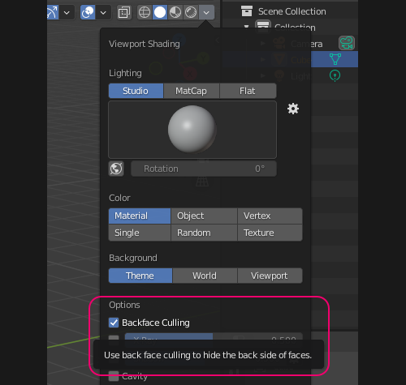

# Inverted normals

Most materials in Unity will render single-sided. This is unlike the defaults of many modelling programs.
The direction of model faces is determined by the winding order of the vertices that make up a triangle.

## Resolution
Research how to **invert/flip normals** in your modelling program. Additional key words to search for are **face normals** and **backface culling**.  
Select the inverted faces and flip their normals.  

^^^

^^^ **Flip normals** in Blender  

**Backface Culling** is single-sided rendering, enable it in your modelling program to see how a model will appear in Unity.

^^^

^^^ **Backface culling** in Blender  

If an object has partially flipped normals there may be a **recalculate normals** operation to unify the normal direction.

---

[My model or material still appears inverted.](../Materials/Rendering%20Issues/Transparent%20Materials.md)
