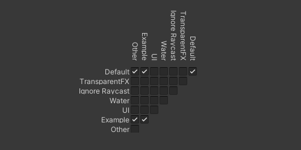

## Layer Collision Matrix (2D)

### Global
Unity's layer-based collision can exclude colliders and triggers from interacting with each other at all.  
Check that the toggles matching the colliders layers are enabled in the project settings.

:::warning{.small}
The Physics 2D settings are separate from the 3D ones.  
:::
See **Edit | Project Settings | Physics 2D**, and the **Layer Collision Matrix** at the bottom.  

  

See [Layer-based collision detection](https://docs.unity3d.com/Manual/LayerBasedCollision.html) for more information.  

### Local
Individual rigidbody components have **layer overrides** that are merged with the global settings.  
By default, **include layers** and **exclude layers** should both be set to **nothing**.  
If you are using these settings, be aware of their impact.

---
[I am still not getting a message.](6%202D%20Transform.md)