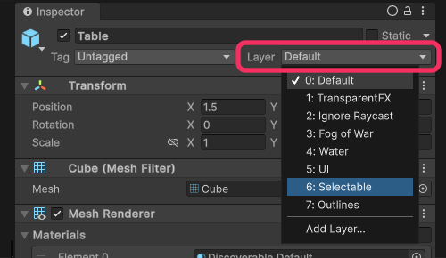

# Physics queries: Ignore Raycast layer

When you do not use a layer mask in a physics query it will use the [`Physics.DefaultRaycastLayers`](https://docs.unity3d.com/ScriptReference/Physics.DefaultRaycastLayers.html) mask, which excludes the **Ignore Raycast** layer.

Check the layers of the gameObjects with colliders you are expecting to hit, do not place them on the **Ignore Raycast** layer.

^^^

^^^ GameObject layer dropdown

---
I am still having problems with my query:
- [I am using 3D physics.](Physics%20Queries%203D.md)
- [I am using 2D physics.](Physics%20Queries%202D.md)
