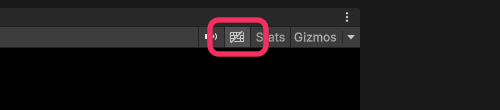

# Disable shortcuts
You can disable Unity's shortcuts in the Game view via the Unity Shortcuts button in the toolbar.

^^^

^^^ Disabling Unity shortcuts via the Game view toolbar

---

Some shortcuts are operating system specific, <kbd>Alt</kbd> + letter keys can trigger menu items from a window's top bar for example. Separating the Game view into a new tab may act as a workaround for these shortcuts.

If you find an unlisted resolution or better workaround please <<report-issue.html>> so this page can be improved.  
