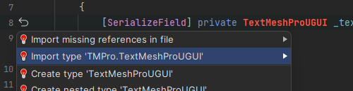

## [CS0246](https://docs.microsoft.com/en-us/dotnet/csharp/language-reference/compiler-messages/cs0246)

```
The type or namespace name 'Foo' could not be found (are you missing a using directive or an assembly reference?)
```


This error is shown when a type isn't found. This is because either:
- The appropriate namespace has not been added.
- The type name has been misspelled.
- The assembly isn't referenced.

#### What are namespaces?
Namespaces are used to differentiate between different types that share the same name, and are required to be referenced if in use.  
They are declared in the `using` block at the **top** of a script:

```csharp
using UnityEngine;
```

### Resolution: Adding the appropriate namespace
:::warning{.inline}  
[Follow this link if you are seeing this error only when building your game.](../../../Building/Editor%20References.md)  
:::
::::note
#### Adding a namespace with your IDE
Most IDEs will help you reference the appropriate namespaces by providing quick actions when your caret is on the relevant block of code.  
Visual Studio has [Quick Actions](https://docs.microsoft.com/en-us/visualstudio/ide/quick-actions),
Visual Studio Code has [Quick Fixes](https://code.visualstudio.com/docs/editor/refactoring#_code-actions-quick-fixes-and-refactorings),
and Rider has [Intention Actions](https://www.jetbrains.com/help/idea/intention-actions.html).  

^^^

^^^If your IDE isn't showing errors or quick fixes, you need to [configure your IDE](../../IDE%20Configuration.md).{.warning}

Take care to add the correct namespace.  
::::  
::::note  
#### Adding a namespace manually
To manually resolve this issue, understand what namespace a Type is in by looking at the documentation or source code.  
The namespace is listed at the top of the documentation.
#### Documentation
- [Unity's API scripting reference](https://code.visualstudio.com/docs/editor/refactoring#_code-actions-quick-fixes-and-refactorings)  
- [Unity package documentation](https://docs.unity3d.com/Manual/PackagesList.html)  
- [.NET (C#) API documentation](https://docs.microsoft.com/en-us/dotnet/api/)
#### Source code
The [Unity C# reference source code](https://github.com/Unity-Technologies/UnityCsReference).  
The source code for packages added to a project can be found under the Packages folder in the Project window.
::::  

### Namespace conflict resolution
If multiple namespaces contain types by the same name, the code needs to specify which is used. You can use this syntax:  
<<Code/Compiler Errors/using Object.rtf>>

---
I am using the appropriate namespace and still having an issue:  
- [I am using Assembly Definitions.](CS0246%20Assembly%20Definitions.md)
- [I am not using Assembly Definitions.](CS0246%20Editor%20Assemblies.md) (Default)