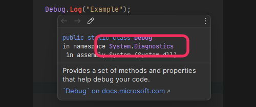

## [CS1061](https://docs.microsoft.com/en-us/dotnet/csharp/language-reference/compiler-messages/cs1061)

```
Type 'Foo' does not contain a definition for 'Bar' and no extension method 'Bar' of type 'Foo' could be found (are you missing a using directive or an assembly reference?)
```
### Missing autocomplete
The type you are using does not contain the member you are trying to use.  
:::warning
If you do not have autocomplete, please [configure your IDE](../../IDE%20Configuration.md).
:::

### Resolving type conflicts
The wrong namespace could be imported, or the type may be redefined in the namespace you are using.
Hover over the type and ensure it has or doesn't have the namespace you expect. 

^^^

^^^ Inspecting a namespace

If the namespace is wrong, make sure you remove that namespace at the top of your file and import the one you intended to use.  

If you have namespace conflicts, you can resolve a type to match a specific namespace like:   

<<Code/Compiler Errors/CS1061.rtf>>

### Types or instances
Often this error is given when new programmers don't understand the distinction between a Type and an instance.  
See [referring to members in other scripts](../../References.md), do not try to use the type name to directly access a member.

### The type does not contain the member
You are likely mistaken and the type does not contain the member. This could mean you are looking at documentation or examples that do not match the version of the code you are using.