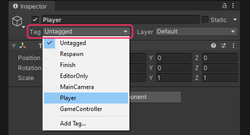

## Undefined Tag

```
Tag: Example is not defined.
```

### Description

Individual GameObjects have tags that can be used to identify them.  
Tags are defined in the [Tags and Layers Settings](https://docs.unity3d.com/Manual/class-TagManager.html) (**Edit | Project Settings | Tags and Layers**).  
Tags are **not** the same as Layers, and don't affect rendering or collision.  
If you are seeing this error you have either not defined one in the first place, or haven't identically referenced an existing tag.  
:::warning
**Identical** includes capitalisation and spaces
:::

### Resolution
Define an identical tag in the Tags and Layers Settings and apply it to the GameObject that is being referenced.  

  

If the error still appears, ensure the console has been cleared. Then log the GameObject and its tag before the [CompareTag](https://docs.unity3d.com/ScriptReference/GameObject.CompareTag.html) call to validate your logic.
See [Logging: how-To](../../Debugging/Logging/How-to.md) for more information.