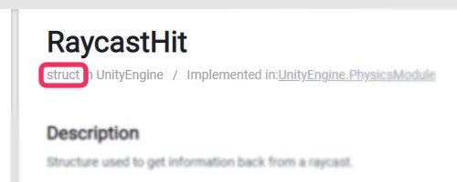

## Null Reference Exception: Reference types
Now we understand [stack traces](Stack%20Trace.md), we know what line is throwing the Null Reference Exception.  

On this line, only **reference types** can be `null`:  
:::note  
`class`, `interface`, or `delegate` types are **reference types**.  
`struct` is **not**.  
:::  

Usually, this can be reduced to *simple*, and *complex* types. Simple structures tend to be structs, `int`, `float`, `Vector3`, `Quaternion`, etc. Complex types tend to be reference types.  
You can double check types by using [the documentation](https://docs.unity3d.com/ScriptReference/) or IDE inspection.  
^^^
  
^^^ Documentation indicating `struct` inheritance.

You can find a more detailed breakdown of reference types [here](../../../Value%20And%20Reference%20Types.md).

---  

[I understand what reference types are.](Access.md)