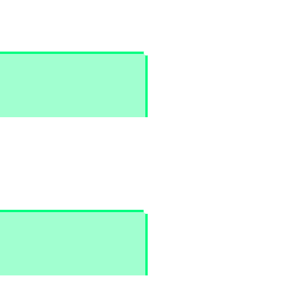

## Shared vertices and smooth shading
Due to Unity's [representation of geometry](../../Models/Geometry%20Details.md) there must be separate vertices for different attributes. These may be be colours, normal information for smoothness/hard edges, UVs, and so on.
Without different vertices then the values in the shared vertex contribute to both triangles, and often cannot properly represent them individually.

In the top image, there is only one vertex shared between the two connected faces, so the vertex contributes its normal to the shading of the face at a 45° angle, smoothing the transition between the two faces.

In the bottom image, there are two vertices, one connected and aligned to the top face, and the other to the bottom. Although both vertices are positioned at the same spot, they are duplicated so there can have different values in the other vertex attributes like normals or UVs.

---

If the edge should be smooth shaded, then sharing vertices is the correct approach.  
If other vertex attributes must form a hard edge, then all other vertex attributes must be duplicated too.
