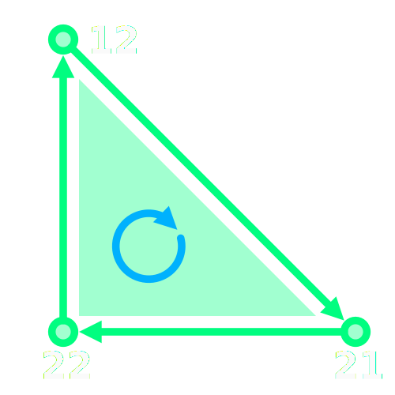

## Triangle winding order
The winding order of meshes in Unity is **clockwise**.

Winding order produces the face normal, the direction a face is looking. The order of the triangle's indices that look up into the vertices array define the winding order. When viewed head-on, the front face's indices should be ordered in a **clockwise** fashion.

Triangle indices are expressed as integer values that point to the vertex attribute arrays, and are in groups of three. Vertices can be reused by the triangle indices.

#### Example


```
vertices: [..., (0, 1), ..., (1, 0), (0, 0), ...]
indices:        12⤴          21⤴    22⤴
```

In this diagram of a triangle the triangle indices must be `21, 22, 12`, `22, 12, 21`, or `12, 21, 22`.  

Other orders would produce a counter-clockwise winding order and the face would not render to the screen from this direction.
