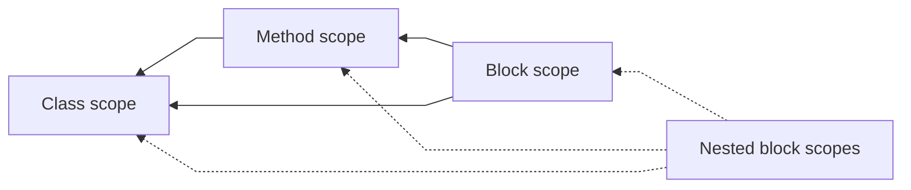

## Scopes in C#

In C# (and most programming languages) variables are accessible in the section they are declared. These sections are known as scopes.

Scopes are indicated by curly braces, <kbd>{</kbd> <kbd>}</kbd>.

### Access
Scopes can access variables of other scopes they are nested in. Scopes cannot reach in to others to use their variables, as they may not be currently available, they may not be "in scope".



Only class scoped variables

### Types of scope
There are three main levels of scope:
1. Class scope
1. Method scope
1. Block-level scope

#### Class scope

Note where a `class` is declared, and view anything at the level of its braces (its scope) as at the class scope.

```csharp
namespace Baz
{
    public class Example : MonoBehaviour
    { // <- The start of a class scope.
        
        // At the class scope.
        [SerializeField] private float _example;
        
    } // <- The class scope has ended.
}
```

The class scope is somewhat unique, because its members are accessible from other scopes.  

#### Method scope

Statements inside a method scope can access the class scope, but cannot access nested block-level scopes.

```csharp
public class Example : MonoBehaviour
{
    public void Foo()
    { // <- The start of a method scope.
        
        // At the method scope.
        float example = 0;
        
    } // <- The method scope has ended.
}
```

Variables declared within method scopes will override those declared in the parent class. Not all scopes can redeclare variables.

```csharp
float x;

public void Example()
{
    // This is a different variable than the one declared outside of the method.
    // This variable is a local variable, local to the scope declared by the "Example" method.
    float x;
    
    // To access the outer variable you would have to use "this.x".
    x = this.x;
}
```

C# uses pascal case (<kbd>PascalCase</kbd>) as its [naming convention](https://learn.microsoft.com/en-us/dotnet/csharp/fundamentals/coding-style/identifier-names#naming-conventions) for public variables, and camel case with an underscore `_` prefix (<kbd>_camelCase</kbd>) for private variables. If you follow convention, it's rare to override variables like this.  

#### Block-level scope
Statements inside a block-level scope can access the class scope, the method scope they're declared in, and any scope that they're nested within.

```csharp
public void Foo()
{
    float method0 = 0;
    
    if (_example == 0)
    {
        float scope1 = 1;
        
        // You can make block-level scopes without an attached statement to control access
        {
            float scope2 = 2;
            // 🟢 "method0", "scope1", and "scope2" are accessible here.
        }
        // 🟠 "scope2" is not accessible here.
    }
    // 🟠 "scope1" and "scope2" are not accessible here.
}
```

Certain single-line statements do not need curly braces to identify scope.

```csharp
public bool Foo()
{
    // Because there are no curly braces, the following statement is the only statement in the block.
    if (UseScope1())
        return false;
    return true;
}
```

If you want use a variable that was assigned in multiple block-level scopes, declare it outside them first.

```csharp
public void Foo()
{
    float method0 = 0;
    
    if (UseScope1())
        method0 = Scope1Result();
    else if (UseScope2())
        method0 = Scope2Result();
    else
        method0 = Scope3Result();
    Debug.Log($"Result is {method0}");
}
```

:::note  
🚧 Under Construction 🚧  
:::

