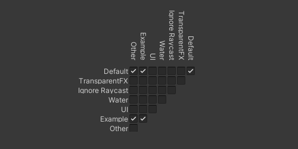

## Layer Collision Matrix

Unity's layer-based collision can exclude colliders and triggers from interacting with each other at all.  
Check that the toggles in the project settings match with the two colliders in question.  

See **Edit | Project Settings | Physics**, and the **Layer Collision Matrix** at the bottom.  

  

See [Layer-based collision detection](https://docs.unity3d.com/Manual/LayerBasedCollision.html) for more information.  

---
[I am still not getting a message](6%203D%20Transform.md)