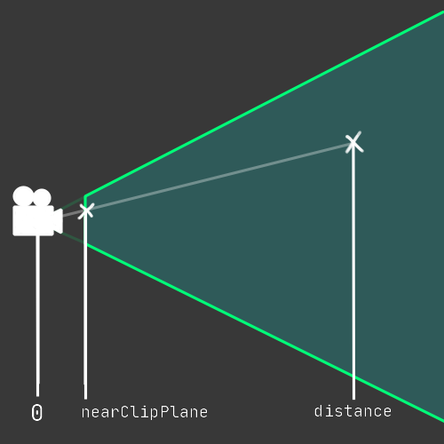

### ScreenToWorldPoint

#### Issue:
ScreenToWorldPoint returns the camera position.  
ScreenToWorldPoint takes a `Vector3` parameter, where the first two values are screen coordinates. The third value is the distance from the camera.
This value is important to provide the ultimate position produced by the function.

#### Resolution:
Provide an appropriate distance in the Vector3 parameter.

  

<<Code/Specific/ScreenToWorldPoint.rtf>>

#### Alternate Methods

Sometimes it is more suitable to use a [Plane](https://docs.unity3d.com/ScriptReference/Plane.html) to avoid calculating an appropriate distance from the camera. This is a suitable approach when the result is on a fixed plane in space.  

<<Code/Specific/Plane Raycast.rtf>>