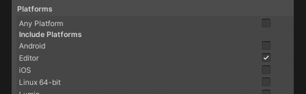

## Editor assembly definitions
### Description
Assembly definitions that are marked as Editor-only will cause the current folder and all sub-folders to become an Editor context.  

^^^

^^^ Editor-only assembly definition

Having runtime scripts in an editor context is invalid.  

### Resolution
Move the script outside of the context created by the editor assembly definition.  

If you are using a scriptable object or prefab, this should also not be inside an editor context.

---  
[My script still cannot be loaded.](General%20Advice.md)