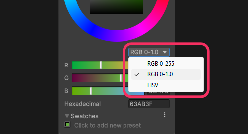

## Color range

The [`Color`](https://docs.unity3d.com/ScriptReference/Color.html) struct defines colours as a `0->1` float, it does **not** use `0->255`.  

### Resolution
If you do want to use 256 stops in a channel (32 bit) use the [`Color32`](https://docs.unity3d.com/ScriptReference/Color32.html) datatype instead.  
Otherwise, convert your values to `0->1` and use [`Color`](https://docs.unity3d.com/ScriptReference/Color.html).  

### Details
`Color32` is implicitly convertable to `Color`. `Color` is used by most APIs, and can support HDR values. `Color32` is used in some contexts to reduce memory footprint ([`Mesh.colors32`](https://docs.unity3d.com/ScriptReference/Mesh-colors32.html) for example).

The values shown in the color picker are based on your current settings and are not indicative of how they're stored in code.  
