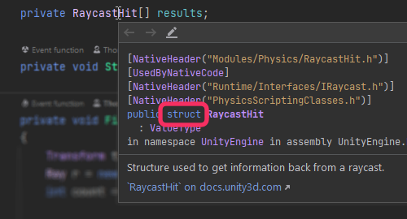
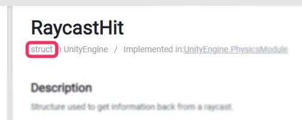

## NullReferenceException: Reference types
Now we understand [stack traces](Stack%20Trace.md), we know what line is throwing the `NullReferenceException`.

On this line, only **reference types** can be `null`:
:::note
`class`, `interface`, and `delegate` types are **reference types**.
`struct` is **not**.
:::

Usually, this can be reduced to *complex*, and *simple* types:
- *Complex* types tend to be reference types, such as `Component`, `GameObject`, or `List`.
- *Simple* structures tend to be structs, such as `int`, `float`, `Vector3`, or `Quaternion`.

You can double-check types by using IDE inspection, or via the [documentation](https://docs.unity3d.com/ScriptReference/).
^^^

^^^ IDE inspection indicating `struct` inheritance.

^^^

^^^ Documentation indicating `struct` inheritance.

You can find a more detailed breakdown of value and reference types [here](../../Programming/Value%20And%20Reference%20Types.md).

---

[I understand what reference types are.](Access.md)
