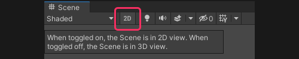

# Scene view: Flythrough mode
If you're having issues with flythrough mode, try these steps from top to bottom.

:::note
### 1. Hold right mouse while moving
You must hold the **right mouse button** to use <kbd>W</kbd>, <kbd>S</kbd>, <kbd>A</kbd>, and <kbd>D</kbd> navigation to fly through the scene.
:::

:::note
### 2. Set the camera speed multiplier to a reasonable value
Make sure the camera speed is set to a reasonable multiplier like **1**.  

You can change this setting via the camera dropdown in the [View Options toolbar](https://docs.unity3d.com/Manual/ViewModes.html) overlay, which is anchored to the top right of the Scene view by default.  
Alternatively, you can use the **scroll wheel** while holding the **right mouse button** in the Scene view to change the speed.
:::

:::note
### 3. Set the camera to Perspective

**Disable** the 2D toggle in the [View Options toolbar](https://docs.unity3d.com/Manual/ViewModes.html) overlay.  

Click the center of the [Scene gizmo](https://docs.unity3d.com/Manual/SceneViewNavigation.html) or the label below the gizmo to toggle between **Perspective** and **Orthographic** views. Change it to **Perspective**.  

---
[I can't find the Scene gizmo.](Enabling%20Overlays.md)  
:::

:::note
### 4. Unlock the camera's perspective
Make sure the [Scene gizmo](https://docs.unity3d.com/Manual/SceneViewNavigation.html) is not locked (the small icon at the top right of the gizmo).
:::

:::note
### 5. Reset the Scene view window
[Reset the Scene view window](../Windows/Resetting%20Windows.md) or the [editor layout](../Windows/Resetting%20Layout.md).
:::

:::note
### 6. Check for errors and warnings
Open the [Console window](https://docs.unity3d.com/Manual/Console.html) (**Window | General | Console**, <kbd>Ctrl+Shift+C</kbd>) and address any errors.    
If errors or warnings are constantly printing they may be related to the Scene view.

Take extra care ensuring that logs are not disabled using the toggles in the top right of the window.
:::

:::note
### 7. Restart Unity
Close and reopen Unity.
:::

---

[Return to Scene view issues.](../Scene%20View.md)
