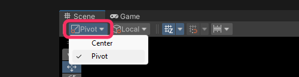

# Pivot Mode
Scene view handles can be positioned at the object's pivot point, or an averaged center point.  

:::info{.small}
The pivot mode orients the handle, and doesn't reposition the object's pivot point.
:::

## Switching pivot mode
In the [Scene view](https://docs.unity3d.com/Manual/UsingTheSceneView.html), find the Tool Settings overlay, and switch between modes.

[I can't find the Tool Settings overlay.](Enabling%20Overlays.md)

## Manually editing an object's pivot

| Asset  | Options                                                                                                                                                                                                          |
|--------|------------------------------------------------------------------------------------------------------------------------------------------------------------------------------------------------------------------|
| Mesh   | - Edit the pivot in an external modelling application. - Use [ProBuilder](https://unity.com/features/probuilder) to edit the pivot. - Create a dummy parent object and position the renderer as a child. |
| Sprite | Edit the pivot using the [Sprite Editor](https://docs.unity3d.com/Manual/sprite-editor-use.html).                                                                                                                |

---  
[See: Positioning GameObjects.](https://docs.unity3d.com/Manual/PositioningGameObjects.html)
