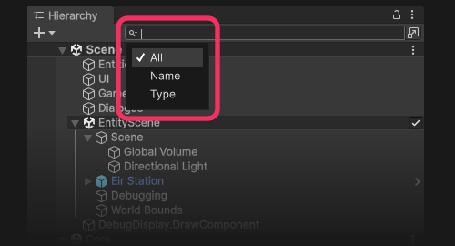

## Searching the scene
You can search the content of loaded scenes via the [Hierarchy](https://docs.unity3d.com/Manual/Hierarchy.html) window's [search](https://docs.unity3d.com/Manual/Searching.html).

You can use various prefixes to narrow the search:

| Prefix | Filter description                  | Example                                                                     |
|--------|-------------------------------------|-----------------------------------------------------------------------------|
| `t:`   | Component type                      | `t:Light`                                                                   |
| `ref:` | Objects that contain a reference to | By instance ID: `ref:49092:` By file: `ref:"Assets/Example Texture.png"` |

You can also narrow the search using the dropdown:

^^^

^^^ Scene view search filter dropdown