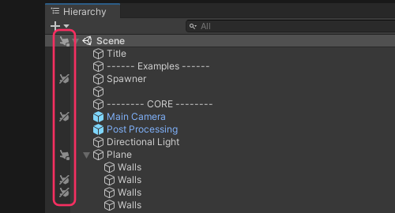

# Scene view: Selection
Check that Scene pickability isn't disabled for the object's layer.

  

To toggle pickability for an object and its children, click the icon in the left-hand pane. Individual objects can be toggled by holding <kbd>Alt</kbd> while clicking.  
See [picking and selecting GameObjects](https://docs.unity3d.com/2020.1/Documentation/Manual/ScenePicking.html) for more information.  

---  

[I still cannot select items in the Scene view.](Layer%20Selection.md)
