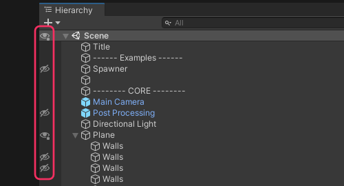
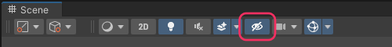

## Scene view: Visibility
Check that Scene visibility isn't disabled.

Visibility can be toggled for an object and its children by clicking the icon. Individual objects can be toggled by holding <kbd>Alt</kbd> while clicking.  
Toggle an isolated view of an object with the shortcut <kbd>Shift+H</kbd>.  
Toggle Scene visibility entirely using the eye icon on the Scene view control bar.  

See [Scene visibility](https://docs.unity3d.com/2020.1/Documentation/Manual/SceneVisibility.html) for more information.  

---  

[I still cannot see items in the Scene view.](Layer%20Visibility.md)