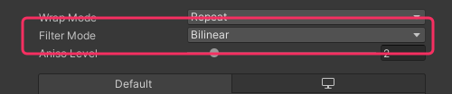

## Filter mode

Filter Mode is how a texture appears when scaled or skewed in the viewport. By default, textures are bilinearly filtered, which means the points between pixels will blur between each other when not perfectly aligned.  

### Resolution
Below the Advanced dropdown of the [Texture Importer](https://docs.unity3d.com/Manual/class-TextureImporter.html#advanced), there is a **Filter Mode** setting, switching this to **Point (no filter)** will remove the blending of pixels, and colour will snap from one pixel to the next no matter how it is scaled.  

^^^

^^^ Filter Mode in Texture Importer

Also consider using Unity's [2D Pixel Perfect package](https://docs.unity3d.com/Packages/com.unity.2d.pixel-perfect@latest/) so the camera consistently aligns to a pixel grid relative to your sprites.

## Advanced filtering
More robust filtering techniques that specialise in pixel art exist that allow for much more flexible and less aliased results:

^^^

^^^ Crafting a Better Shader for Pixel Art Upscaling