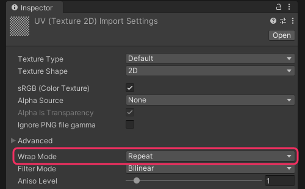

# Texture wrap mode: Clamp

<<Graphics/Wrap Mode.md>>

## Resolution
Navigate to the source asset in the [Project window](https://docs.unity3d.com/Manual/ProjectView.html), and switch the **Wrap Mode** to **Clamp**.  

  

---

[My texture is transparent and I still have issues.](Transparency%20Fringing.md)
